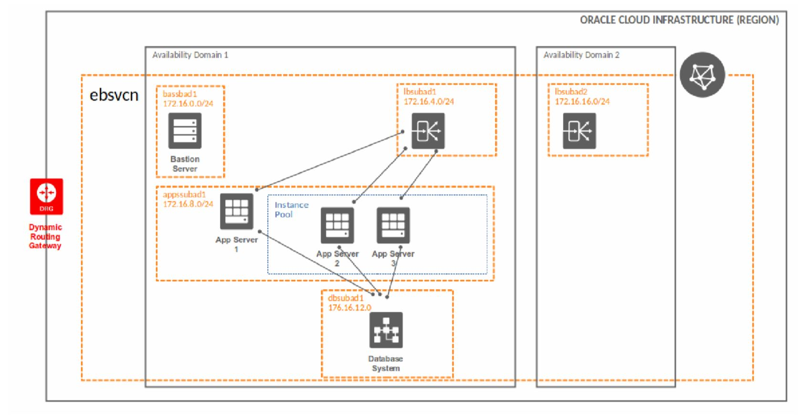

# Oracle E-Business Suite application node autoscaling on Oracle Cloud Infrastructure

This procedure can be used to autoscale an Oracle E-Business Suite application tier node in multi node application tier configuration.The procedure uses Oracle Cloud Infrastructure compute autoscaling, in conjunction with cloud-init, ansible and Oracle E-Business Suite addnode functionality to add application nodes on demand.

### Architecture for Deploying Oracle E-Business Suite in a Single Availability domain with autoscaling


## Assumptions/Pre-requisites

1. It is assumed that a multi-node Oracle E-Business Suite 12.2 environment is available. For creating Oracle E-Business Suite infrastrucure on OCI, the terraform templates provided on github (https://github.com/oracle/cloud-asset-appsul-terraform-samples/tree/master/EBusinessSuite) can be used. After creating the infrastructure using terraform templates, Oracle E Business suite 12.2 (with Oracle RDBMS 12.1.0.2) can be installed and configured manually. It is also possible to configure autoscaling in an existing EBS deployment.

2. The Oracle E-Business Suite application tier must be created on a shared application filesystem like FSS (File Storage Service).

3. An instance pool has been created to configure autoscaling for EBS application tier. The primary (master) node of application tier should not be part of Instance pool. The secondary node application tier must be added to instance pool. 

## Oracle E-Business Suite Autoscaling scripts structure

```
.
├── ansible
│   ├── addnode.yml
│   ├── addsharednode.sh
│   ├── addsharednode.yml
│   ├── ansible.cfg
│   ├── _docs
│   ├── files
│   │   └── hosts.sh
│   ├── group_vars
│   │   └── all
│   │       ├── config.yml
│   │       └── default.yml
│   ├── inventory
│   ├── post_addnode_master.yml
│   ├── pre_addnode_global.yml
│   ├── pre_addnode_local.yml
│   ├── pre_addnode_master.yml
│   ├── pre_clone_master.sh
│   ├── pre_clone_master.yml
│   └── vars
├── _docs
│   └── ebs-autoscaling.JPG
├── genpairs.sh
├── LICENSE.md
├── README.md
├── sample.appspairs.txt
├── sample.hosts.orig
└── stress.sh

7 directories, 21 files
```

- [**scripts**]:
  - [hosts.orig]: This is a copy of /etc/hosts file from master application node.
  - [appspairs.txt]: This is a custom pairs file from primary application node and is used to generate pairs file for additional nodes.
  - [genpairs.sh]: This shell script is used to generate secondary node application pairs file from primary node application pairs file.
  - [stress.sh]: This can be used to generate CPU spike on system to kick off autoscaling.

- [**scripts/ansible**]: The directory contains ansible playbooks for adding application nodes to Oracle E-Business suite implementation.
  - [pre_clone_master.yml]: This playbook can be used to run preclone on primary application node.
  - [pre_addnode_local.yml]: This playbook is executed on newly added compute node to update /etc/hosts and other local node tasks.
  - [pre_addnode_global.yml]: This playbook is executed on all inventory nodes to update /etc/hosts with newly added node.
  - [pre_addnode_master.yml]: This playbook is executed on primary node to perform pre-requistes for node addition.
  - [addnode.yml]: This playbook is executed on newly added compute node to perform EBS configuration on newly added node.
  - [post_addnode_master.yml]: This playbook is executed on primary node to perform post node addition steps.
  - [addsharednode.yml]: This is a master playbook that calls all other playbooks to add node into EBS configuration.

- [**scripts/ansible/addsharednode.sh**]: This shell script calls scripts/ansible/addsharednode.yml playbook to perform node addition tasks.

- [**scripts/ansible/pre_clone_master.sh**]: This shell script calls scripts/ansible/pre_clone_master.yml to perform pre clone tasks on EBS primary node.

- [**scripts/ansible/group_vars**]: This shell script calls scripts/ansible/adddsharednode.yml to perform node addition tasks.
  - [all/config.yml]: This yml file contains user defined variables required for playbooks. All variables defined in this yml file are requred to be updated with right information before executing the playbooks.
  - [all/default]: This yml file contains additonal variables that are computed automatically by using variables from group_vars/all/config.yml. This file does not require any manual updation.

- [**scripts/files/hosts.sh**]: This shell script is used to update /etc/hosts on newly added node.
- [**scripts/files/inventory**]: Ansible inventory file.
- [**scripts/files/ansible.cfg**]: Ansible configuration file.

## Inputs required in the group_vars/all/config.yml file

The following inputs are required for terraform modules:

| Argument                   | Description                                                                                                                                                                                                                                                                                                                                                       |
| -------------------------- | ----------------------------------------------------------------------------------------------------------------------------------------------------------------------------------------------------------------------------------------------------------------------------------------------------------------------------------------------------------------- |
| apps_user                  | Oracle E-Business Suite application user. |
| apps_pass                  | Oracle E-Business Suite application password.|
| weblogic_pass              | Oracle E-Business Suite weblogic password.|
| apps_base                  | Oracle E-Business Suite application base install directory. For example - /u01/install/APPS.|
| oracle_user                | Oracle E-Business Suite application binaries owner.|
| database_pdb_name          | Oracle E-Business Suite database PDB name.|
| master_hostname 			 | Oracle E-Business Suite master hostname.Hostname of first node where weblogic admin server is running.|
| logical_domain 			 | Oracle E-Business Suite application logical domain.For example - example.com.|

##### Sample group_vars/all/config.yml file

```hcl
# Oracle E-Business Suite application user
apps_user: apps

# Oracle E-Business Suite application password
apps_pass: <apps_password>

# Oracle E-Business Suite weblogic password
weblogic_pass: <weblogic_password>

# Oracle E-Business Suite application base install directory. For example - /u01/install/APPS
apps_base: /u01/install/APPS

# Oracle E-Business Suite application binaries owner
oracle_user: oracle

# Oracle E-Business Suite database PDB name
database_pdb_name: EBSDB

# Oracle E-Business Suite master hostname.Hostname of first node where weblogic admin server is running
master_hostname: ebsappash11

# Oracle E-Business Suite application logical domain.For example - example.com
logical_domain: oci.com
```

## Automation Flow

```
•	cloud-init is invoked.
  ◦	Installs packages - oracle-ebs-server-R12-preinstall, ansible etc.
    ▪	Mounts shared application filesystem (FSS) as /u01/install/APPS on new node.
    ▪	Open ports (7001-7002,7201-7202,7401-7402,7601-7602,8000) in host firewall.
    ▪	Invokes /u01/install/APPS/ansible/addsharednode.sh script.
      •	addsharednode.sh calls Ansible playbook addsharednode.yml
        ◦	Ansible playbook addsharednode.yml
          ▪	Calls Ansible playbook - pre_addnode_local.yml that runs on newly added local node.
            •	Ansible playbook - pre_addnode_local.yml calls /u01/install/APPS/ansible/files/hosts.sh script
              ◦	To add newly added node to /u01/install/APPS/scripts/hosts.orig file.
              ◦	To copy updated /u01/install/APPS/scripts/hosts.orig to /etc/hosts to newly added local node.
              ◦	Updates /etc/oci-hostname.conf to set PRESERVE_HOSTINFO=2
            •	Calls Ansible playbook - pre_addnode_global.yml that runs on all nodes in inventory file.
              ◦	To copy /u01/install/APPS/scripts/hosts.orig to /etc/hosts all application nodes.
            •	Calls Ansible playbook - pre_addnode_master.yml that runs on master node.
              ◦	To check Adminserver status on master node RUN filesystem and starts it if it is down.
              ◦	To check Adminserver status on master node PATCH filesystem and starts it if it is down.
            •	Calls Ansible playbook - addnode.yml that runs on newly added local node.
              ◦	To check if source pairs file required for add node operation exist.
              ◦	Deletes secondary node pairs file if it exists.
              ◦	Creates secondary node pairs file using shell script /u01/install/APPS/scripst/genpairs.sh
              ◦	Rechecks if secondary pairs file has been created by previous step.
              ◦	Runs add node to add node in EBS configuration.
              ◦	Starts service on newly added node (if addnode in previous step is successful). The newly added node is ready to accept traffic now.
              ◦	Checks Nodemanager on PATCH filesystem and shuts it down if it is running.
            •	Calls Ansible playbook - post_addnode_master.yml that runs on master node.
              ◦	Checks Adminserver status on master node PATCH filesysystem and shuts it down if its running.
              ◦	Checks Nodemanager status on master node PATCH filesysystem and shuts it down if its running.

Note: master/primary node is the EBS application node (App server 1) running weblogic admin server.
```

## Cloud-init template for EBS application servers

Following is the cloud-init template used to invoke addsharednode.sh a:

```yaml
#cloud-config
timezone: "${timezone}"

packages:
  - rsync
  - nfs-utils
  - ntp
  - oracle-ebs-server-R12-preinstall
  - stress
  - ansible
  - nc

runcmd:
  - sudo mkdir -p ${src_mount_path}
  - sudo mount -t nfs -o rw,bg,hard,timeo=600,nfsvers=3,tcp ${src_mount_target_private_ip}:${src_export_path} ${src_mount_path}
  - sudo chown oracle:oinstall ${src_mount_path}
  - echo ${src_mount_target_private_ip}:${src_export_path} ${src_mount_path} nfs rw,bg,hard,timeo=600,nfsvers=3 0 0 >> /etc/fstab
  # Run firewall command to enable to open ports
  - firewall-offline-cmd --port=${app_instance_listen_port}:tcp
  - firewall-offline-cmd --port=7001:tcp
  - firewall-offline-cmd --port=7002:tcp
  - firewall-offline-cmd --port=7201:tcp
  - firewall-offline-cmd --port=7202:tcp
  - firewall-offline-cmd --port=7401:tcp
  - firewall-offline-cmd --port=7402:tcp
  - firewall-offline-cmd --port=7601:tcp
  - firewall-offline-cmd --port=7602:tcp
  - /bin/systemctl restart firewalld
  - cd ${src_mount_path}scripts/ansible
  - sudo sh addsharednode.sh
```

## How to use this automation

1) Create Oracle E-Business Suite Infrastructure using terraform modules on github. Create only 1 application node.

2) Install and Configure EBS on created infrastructure.

3) Create instance configuration, instance pool and attach EBS load balancer to instance pool.

4) Download autoscaling scripts to /u01/install/APPS directory.

3) Create appspairs.txt and hosts.orig file under /u01/install/APPS/scripts.

4) Update /u01/install/APPS/ansible/inventory with master/primary node information.

5) Update Number of instances in instance pool from 0 to 1. This will add 2nd node in EBS configuration and added node will be part of instance pool and EBS load balancer.

6) Create autoscaling configurations.

7) Run stress.sh on node in instance pool. This will kick autoscaling which in turn will invoke addsharednode.sh script as part of cloud-init and node will added into the configuration. 

## Disclaimer
The scripts are provided for educational purpose only without any support.
